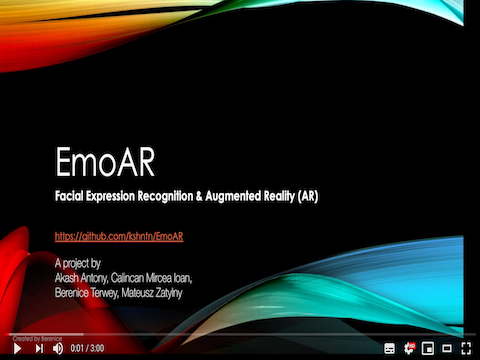
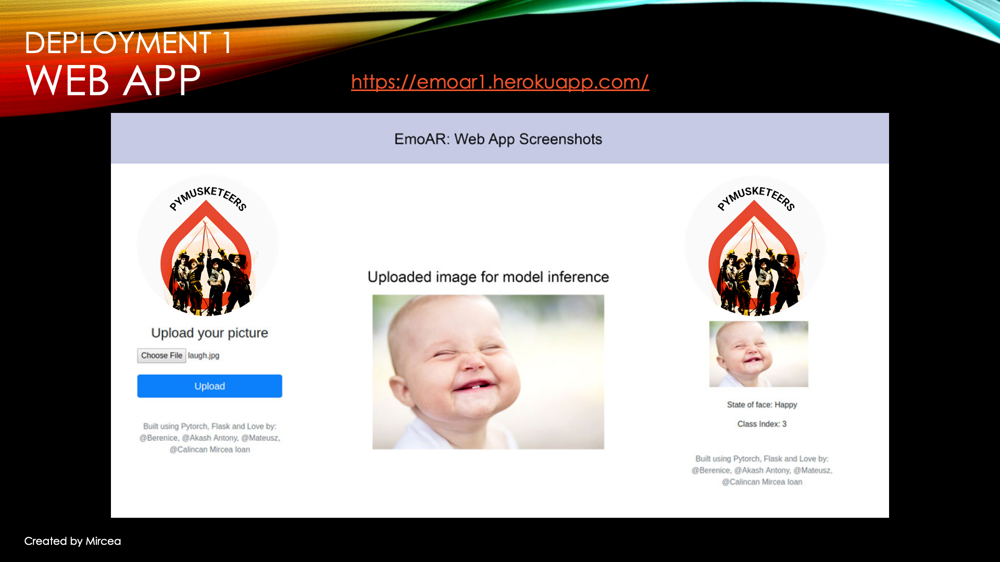
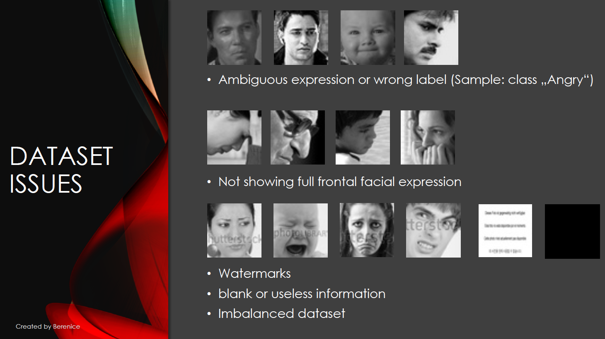
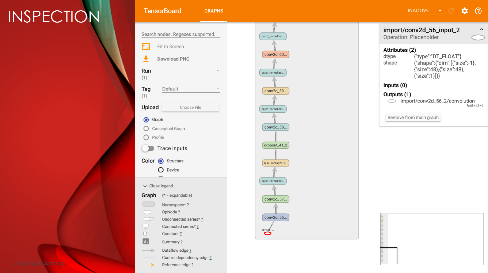
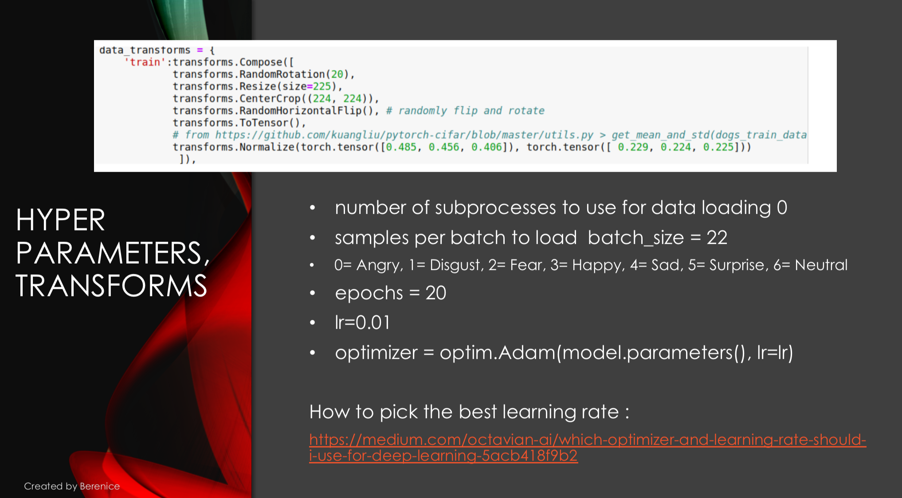
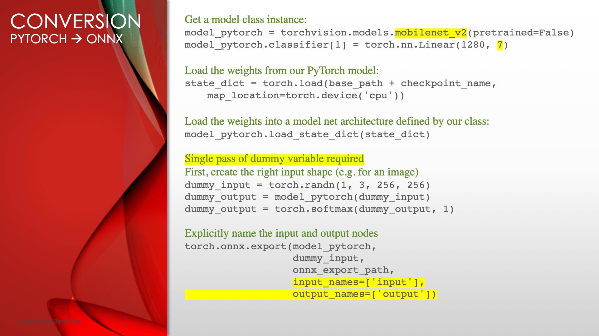
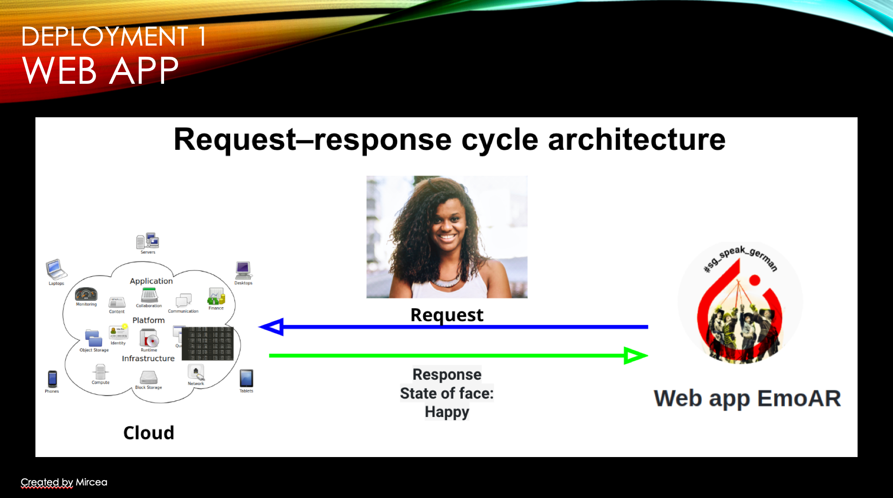
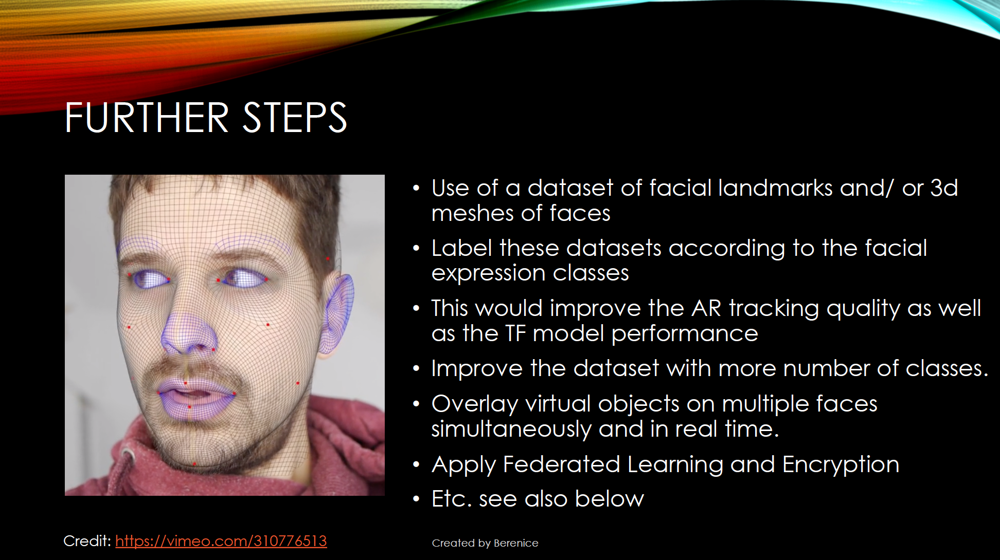

Repository for Facial Emotion Recognition Project for the PyTorch Hackathon September 2019

Team: PyTorch Musketeers

# EmoAR
## Facial Expression Recognition and Augmented Reality (AR)

**EmoAR is a mobile AR app that aims to recognize facial expression in real time and to superimpose virtual content according to the recognized facial expression. We also created a web app (without AR).**

A project by team PyTorch Musketeers:  
&nbsp;&nbsp;&nbsp;&nbsp;&nbsp;&nbsp;&nbsp;&nbsp;&nbsp;&nbsp;&nbsp;&nbsp;Mateusz Zatylny, @Mateusz  
&nbsp;&nbsp;&nbsp;&nbsp;&nbsp;&nbsp;&nbsp;&nbsp;&nbsp;&nbsp;&nbsp;&nbsp;Berenice Terwey, @Berenice  
&nbsp;&nbsp;&nbsp;&nbsp;&nbsp;&nbsp;&nbsp;&nbsp;&nbsp;&nbsp;&nbsp;&nbsp;Akash Antony, @Akash Antony  
&nbsp;&nbsp;&nbsp;&nbsp;&nbsp;&nbsp;&nbsp;&nbsp;&nbsp;&nbsp;&nbsp;&nbsp;Calincan Mircea Ioan, @Calincan Mircea Ioan  

**Table of Content:**

- Watch the full video presentation
- Short project description
- Impact of EmoAR and its further implications
- Where to get the EmoAR apps: Android AR app, Web app
- Existing problem
- Our workaround
- How we built EmoAR with PyTorch
- Dataset Description
- About model training
- About model conversion
- About the Android project
- About the Web App project
- Next steps. How to improve the project?

**Full video presentation (30 min):**
https://youtu.be/EaHArrEaEaQ?t=105

**Short description of our project:**

EmoAR is a mobile AR application (mobile device with ARCore support is required) that aims to recognize human facial expression in real time and to superimpose virtual content according to the recognized facial expression. 
For example: Depending on the predicted facial expression, EmoAR would overlay randomized famous quotes about the expression, in AR. (Quotes can motivate people to take positive changes in their life.)

The live AR camera stream of a mobile device (Android) is input to a segmentation tool (using tiny YOLO) that detects faces in the video frames in real time. 
The detected areas with a face are fed into a model that was trained on the public FER dataset (from a Kaggle competition 2013). 
The facial expression of the detected face is determined in real time by using our model trained with PyTorch and converted to Tensorflow Lite for use in Android. Depending on the model prediction (the output result), different virtual content overlays the face. This virtual augmentation of a face is done with Augmented Reality (ARCore). 

Since ARcore is only supported by a small number of Android devices, we also deployed the PyTorch model to a web app using Flask and Heroku, but without the AR feature. 

**Impact of EmoAR and its further implications**

1. Text overlays displaying the detected facial expression: EmoAR might help people with Asperger syndrome and autism in learning about the expression of a face.

2.  A classifier of facial expressions (trained model) will enhance robotic projects related to therapies that help autistic people to socialize. For example: [How Kaspar the robot is helping autistic students to socialise](https://www.abc.net.au/news/2018-06-05/the-creepy-looking-robot-teaching-kids-social-skills/9832530?pfmredir=sm)
    
3. It may also be used as a HR tool and support recruiters in evaluating the overall confidence level of an interviewee by measuring the change in emotions during the interviewee's responses in real time.
    
4.  3d models or graphics, artistic content: In social media apps like Instagram and Facebook, this could be used to suggest emojis, avatars, artistic visual content which suit the detected facial expression, so that the user can take a selfie or videos with superimposed emojis, avatars and/ or artistic visuals as AR filter. 
We took a look at Spark AR, but unfortunately have not yet found a function/ method to access the CameraTexture by code in order to send these camera images via a web request to our inference tool that would return the PyTorch model prediction to a Spark AR application. 

**Get the ARcore Android app EmoAR:**[Download apk](https://github.com/kshntn/EmoAR/tree/master/apk)

[**TODO** add the correct link to the -.apk]

Our -.apk Android app file is too big for the GitHub repo. Thus, we had to split it in 2 file pieces. How to install the Android app:
1.  Check if your device supports ARCore. A list of ARCore supported devices: [https://developers.google.com/ar/discover/supported-devices](https://developers.google.com/ar/discover/supported-devices)
2.  Install winrar 
3.  Download both files 
4.  Both files have to be in same directory
5.  Then, open part 1 and unpack
6.  Allow installations of “unknown sources” in the Settings. 
7. Check if your device supports ARCore. A list of ARCore supported devices: https://developers.google.com/ar/discover/supported-devices
8. Install the ARCore package from Google Play
9. Open the EmoAR app, grant camera access 
10. Slowly move the camera and gather ARPlanes (white grids) and AR feature points (cyan blue points)
11. Then, point the camera to a face, slowly move it around the face and wait until a virtual 3d arrow is positioned near the face. Alternatively, you may also tap on a feature point to place that arrow manually. 
12. After a few moments, the recognized facial expression should appear as texture on the 3d arrow and change according to the model result. It may take a bit time until the new texture is rendered.

[**TODO** add the correct demo video link]
**Demo video below:** [https://www.youtube.com/watch?v=Ezcn6U7Bz2U]

**Go to the web app EmoAR:** [https://emoar.herokuapp.com/]

As just a limited number of Android devices support ARCore, we also developed a web app using Flask and Heroku. 

Click below to test our web app

**Existing problem:**

OpenCV and AR frameworks like Vuforia, ARKit, ARcore do not work well together, because the input video stream of the AR camera has to be shared with the other frameworks and/ or SDKs.

In our project we need to determine whether and where faces are located in a video frame. With OpenCV techniques, haarcascade etc, this would have been an easy task, but it would prevent us from using the camera stream for the Augmented Reality overlay.

**Our workaround:**

Instead of using OpenCV’s techniques, we access the AR camera stream, we use YOLO to determine a person in a video frame, we crop this AR camera image, convert it to a Bitmap and feed a copy of it as input in our custom PyTorch model to determine the facial expression of this face in real time. Most tasks are done asynchronously, the rendering of virtual AR overlays is done by accessing the OpenGL thread.

**How we built EmoAR with PyTorch:**

-   Trained CNNs with PyTorch specifically for mobile applications and web applications
    
-   Trained CNNs using a custom architecture and alternatively using transfer learning with pre-trained PyTorch models 
    
-   Model conversion from PyTorch to ONNX to Tensorflow to Tensorflow Lite for use in mobile applications, Unity3d and Android
    
-   Development of a REST API by using Flask.
    
-   PyTorch Model deployment to a web app Heroku
    
-   Converted PyTorch model deployment to Unity3d and Android
    
-   Combination of Deep Learning and Augmented Reality (AR) in an Android app. Deep Learning determines the kind of visual AR content.
    
-   Sharing of the AR camera feed with other APIs to be able to input the AR camera feed to the CNN, rendering on the OpenGL thread

**Data Description:**

We used the FER2013 dataset from Kaggle for training. [ [https://www.kaggle.com/c/challenges-in-representation-learning-facial-expression-recognition-challenge/overview](https://www.kaggle.com/c/challenges-in-representation-learning-facial-expression-recognition-challenge/overview) ]
It was prepared by Pierre-Luc Carrier and Aaron Courville and consists of grayscale facial images of size 48x48 px. The faces are segregated and categorized into 7 classes: 0=Angry, 1=Disgust, 2=Fear, 3=Happy, 4=Sad, 5=Surprise, 6=Neutral
A total of 28,709 examples was used for training the models, which were further validated with 3,589 examples.

Dataset issues we encountered: 	

			i.   the dataset is unbalanced
    
			ii.  some images are ambiguous and have mixed emotions.
    
			iii. some images are wrong, i.e. only showing loading icons etc.
    
    

**About model training:**

We experimented with and trained several pre-trained models of different architectures:

-   ResNeXt50,
    
-   Inception Resnet v2,
    
-   MobileNet v2,

-   SqueezeNet,
    
-   DenseNet121,
    
-   ResNet101,
    
-   a custom CNN
    

  

  

We experimented with

-   data augmentation, i.e. rotation, horizontal flip
    
-   unfreezing some of the last layers
    
-   SGD and Adam optimizers,
    
-   different learning rates
    
-   schedulers – MultiStepLR, ReduceOnPlateau
    
-   weight initialization of linear layers in a custom CNN
-  started cleaning the FER dataset
    
-   trained with PyTorch for the web app 
-  converted our best PyTorch models to Tensorflow Lite

**About model conversion:**

Initially, we wanted to deploy to an Augmented Reality app (iOS and Android) via Unity3d using TensorflowSharp to do the inference. (Tensorflow -.pb files are supported by Unity3d.)
The conversion chain is as follows: PyTorch → ONNX → Tensorflow -.pb  
We also tried the recently released Inference Engine by Unity3d with the Unity3d Barracuda backend from the ML Agents Toolkit.
Due to incompatibility issues concerning the Tensorflow versions as well as our models’ architectures with Barracuda, we dropped the app development in Unity3d, the issues led to crashes of Unity (as of August 2019). 

We switched to the development in Android (Java) with Tensorflow Lite and ARCore. 
The conversion chain for use in Android is as follows: PyTorch → ONNX → Tensorflow -.pb  → Tensorflow Lite. The conversion to Tensorflow Lite reduced the model size by 66% to only 33% of the model size. 

An alternative conversion would be PyTorch to Caffe2 for use in Android (but the team's knowledge of C++ has become a bit too rusty) or the conversion from Keras to Tensorflow Lite (which we tried for the Android app, too, as this is a quite straight forward approach.)

**About the Android project:**

We used the following Android APIs and frameworks:

-   android.graphics
    
-   android.opengl
    
-   com.google.ar.core
    
-   org.tensorflow.lite

to name but one

To overlay and to place virtual 3d content with ARCore, ARPoint Clouds and ARPlanes are currently used. Learn about a better approach in the last section “Next steps. How to improve the project”

**About the web app project:**

We developed a REST API by using Flask. The image uploaded by the user is input as parameter. After model inference on the server, the prediction is returned as a base64-encoded string to the Heroku web app.

Flask is a Python micro-framework that is used to develop web applications. Is a lightweight Web Server Gateway Interface application framework. It is designed to make getting started quick and easily, with the ability to scale up to complex applications.

Heroku is a Platform as a service (PaaS) which enables developers to build, run, and operate applications entirely in the cloud. Heroku abstracts us from dealing with servers. All we have to do is sign up, download a few tools and then upload our code to the platform effortlessly. 

*Steps to be followed to deploy the Pytorch model to a web app:*

	1.	Save the trained model object - in .pt format
	
	2.	Create a Flask environment that will have an API endpoint which would encapsulate our trained model, and enable it to receive inputs (features) through GET requests over HTTP/HTTPS and then return the prediction .
	
	3.	import torch, torchvision import models, from PIL import Image,  import torchvision.transforms as transforms
	
	4.	Normalise the image tensor with the required mean and standard deviation values
	
	5.	Use transforms from torchvision library and build a transform pipeline, which transforms our images as required.
	
	6.	Upload the flask script along with the trained model on Heroku
	

**Next steps. How to improve the project:**

1.   Higher accuracy of the model
    
2.   Cleaning the FER 2013 dataset, a small dataset (28.000 grayscale images, 48x48) taken from Kaggle
    
			i.   the dataset is unbalanced
    
			ii.  some images are ambiguous and have mixed emotions.
    
			iii. some images are wrong, i.e. only showing loading icons etc.
    
			iv.  gather RGB color images for a dataset
    

  

3.  Improve the dataset with more number of classes.
    
4.  Use of a dataset of facial landmarks and/ or 3d meshes (3d objects) of faces, because currently the app works best, if flat images of faces are used for inference. This would increase the model performance enormously, especially if the app has to deal with rotated faces. Although we have found a few public datasets of facial 3d meshes, it still would have to be labelled according to facial expression classes. Due to lack of time and of GPU resources for training such large sized datasets, we have not yet tackled it. 
To superimpose and to place virtual 3d content with ARCore, ARPoint Clouds and ARPlanes are currently used. A better approach in this regard is:
Use the 3d mesh of the face that is generated by ARCore and ARKit for face tracking to superimpose the virtual 3d content as well as for model inference. This requires a dataset that has been trained on such 3d face meshes, is labeled (expression classes) and also gives information about landmarks. (Currently, we are using AR Point Clouds and AR Planes for tracking)
    
5.  Superimpose virtual objects on multiple faces simultaneously and in real time. With sophisticated Computer Vision algorithms, faces would not have to be detected "from scratch" in each frame of the camera stream. Such algorithms would improve the performance. 
    
6.  Create virtual content to overlay as described above: emojis for social media apps, text overlays, artistic visual content which suit the detected facial expression as AR filters /virtual overlay. 

7.  Improve the UX: Currently, the app starts immediately the AR Activity. Add more Activities (screens) that introduce the app and provide some help concerning the AR Activity. Handle a resumed AR Activity properly. 

**Incorporation of PySyft (Federated Learning and Encryption), in this project and future prospects:**

1.  User's data and training data will not leave the device and individual updates will not be stored in any servers/data centers.
2.  The data for training the models in this project are used taking into consideration any copyright and privacy  issues.

For future release and improvement of our PyTorch model with new high quality private images, we plan to incorporate federated learning and encryption in order to secure the prediction of our classification models:

The user’s device will download the current shared model from a cloud,  will improve it by learning from and training on  local data on the device. Then the modifications will be summarized as an update. This model update will be sent back to the cloud where it is averaged with other user updates in order to improve the commonly shared model. All communication will have to be encrypted. 
This way, Federated Learning enables end devices to collaboratively learn a commonly shared prediction model while keeping all the training data on device.

Why we have not applied PySyft yet, as of August/September 2019:

Problems using Differential Privacy and Federated Learning in our dataset
1.  Issues with using Encryption, Federated Learning, CNN and BatchNorm layers in pre-trained models.
2.  No GPU support for PySyft resulting in longer training times[ [https://github.com/OpenMined/PySyft/issues/1893](https://github.com/OpenMined/PySyft/issues/1893) ]

